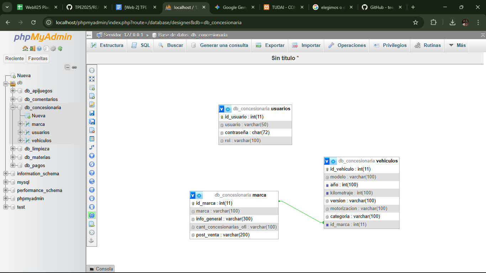

# Trabajo Práctico Especial (TPE)

## Integrantes del grupo
- Teo Iván Blas García – teoblas71@gmail.com
- (encargado de la parte A del proyecto)
- thomas arnaiz – thomas1122arna@gmail.com
- (encargado de la parte B del proyecto)

## Temática del TPE
concesionaria de autos

## Descripción
## Descripción Este TPE consiste en gestionar información de vehículos, tanto nuevos como usados. 
Se planteó una base de datos que permite: 
- Registrar vehículos y sus características.
- consultar detalles sobre el vehiculo
- registrar marca de vehiculo
- consultar detalles sobre la marca
El objetivo es poder organizar y acceder fácilmente a la información de los vehículos según diferentes criterios, usando relaciones entre tablas.

## Como desplegar el sitio 
Instrucciones para importar la base de datos en PHPMyAdmin

1.Abre phpMyAdmin en tu navegador.
2.Crea una nueva base de datos llamada db_concesionaria.
3.Selecciona la base de datos db_concesionaria.
4.Haz clic en la pestaña Importar.
5.Haz clic en Seleccionar archivo y elige el archivo database/db_concesionaria.sql de este proyecto.
6.Presiona Continuar para importar las tablas y datos.

## manejo de sessiones
usuario: webadmin
contraseña:webadmin

## manejo de urls
-http://localhost/tpeweb2/concesionaria //muestra tanto vehiculos como marcas
-http://localhost/tpeweb2/vehiculos //muestra solo vehiculos 
-http://localhost/tpeweb2/marcas //muestra solo las marcas
-http://localhost/tpeweb2/login //muestra formulario de inicio de session

